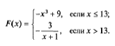

# Task02 #

## Branching Statements. ##

> 5. Составить программу: определения наименьшего из двух чисел a и b.

> 15. Даны действительные числа х и у, не равные друг другу. Меньшее из этих двух чисел заменить половиной их суммы, а большее — их удвоенным произведением.

> 20. Определить, делителем каких чисел а, b, c является число k.

> 30. Даны действительные числа а,b,с. Удвоить эти числа, если а > b > с, и заменить их абсолютными значениями, если это не так.

> 40. Вычислить значение функции: 

## Loops ##
