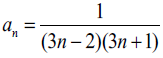

# Task02 #

## Branching Statements. ##

> 5. Составить программу: определения наименьшего из двух чисел a и b.

> 15. Даны действительные числа х и у, не равные друг другу. Меньшее из этих двух чисел заменить половиной их суммы, а большее — их удвоенным произведением.

> 20. Определить, делителем каких чисел а, b, c является число k.

> 30. Даны действительные числа a, b, с. Удвоить эти числа, если a > b > с, и заменить их абсолютными значениями, если это не так.

> 40. Вычислить значение функции:   

## Loops. ##

> 5. С помощью оператора while напишите программу определения суммы всех нечетных чисел в диапазоне от 1 до 99 включительно.

> 15. Вычислить : 1 + 2 + 4 + 8 + ... + 2 в 10 степени.

> 20. Даны числовой ряд и некоторое число е. Найти сумму тех членов ряда, модуль которых больше или равен заданному е. Общий член ряда имеет вид:   

> 30. Написать программу, переводящую римские цифры в арабские.

> 40. Получить все числа, не превышающие заданного числа N, которые делятся без остатка на все свои цифры.
